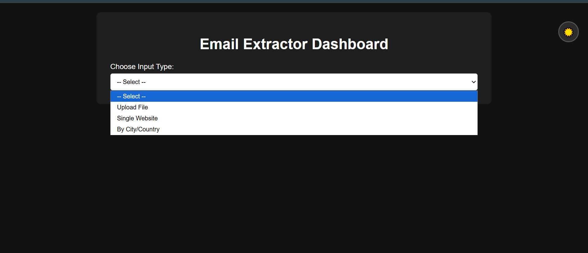

# Lead Generator App 📨

A Flask-based web dashboard that helps you generate leads by extracting emails from websites. You can input links manually, upload files, or search based on service, country, and city.

---

## 🔧 Features

- 🧾 Upload `.txt`, `.csv`, or `.xlsx` files containing URLs
- 🌐 Enter a website link directly
- 🌍 Generate leads by specifying service + country + city
- 📥 Download extracted emails and their sources as Excel file
- 🌙 Light/Dark mode toggle
- 📱 Responsive Dashboard UI

---

## 📦 Tech Stack

- **Python 3**
- **Flask**
- **Pandas**
- **BeautifulSoup4**
- **openpyxl**
- **HTML / CSS / JS**

---
## 📸 Demo Screenshots

